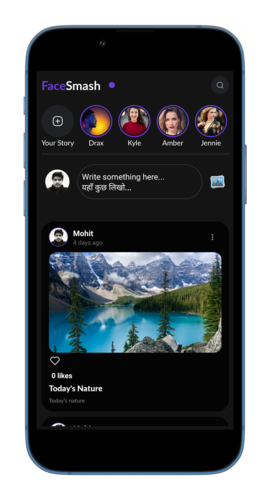
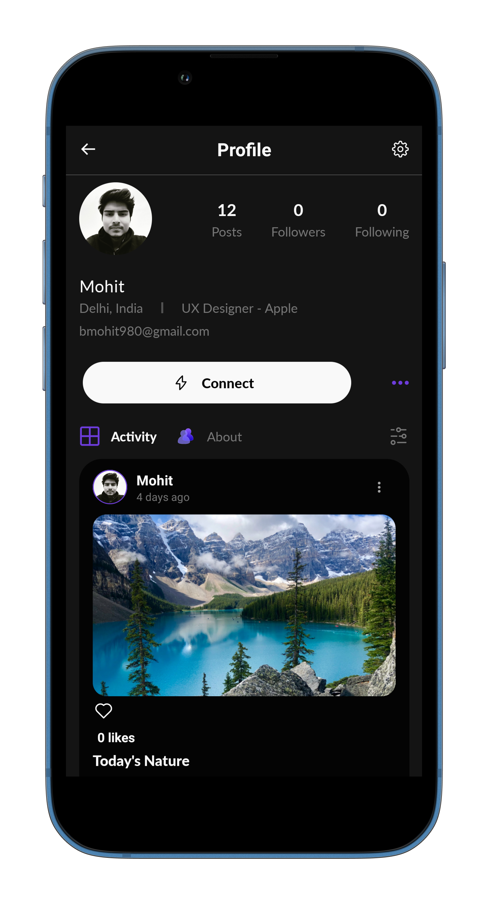

# FaceSmash 🧋

It's a social media platform where users can interact with friends or family. It's a native application for both android and ios

## Screenshots

 

## Features

- Email and Password based authentication with refresh token
- Post Creation with or without images
- Post Like/Dislike
- Infinite querying
- User Profile
- Edit Profile
- more to come...

## Environment Variables

To run this project, you will need to add the following environment files you can contact me at bmohit980@gmail.com for these files.

`google-services.json`

`GoogleService-Info.plist`

## Run Locally

Clone the project

```bash
  git clone https://github.com/Mohitb07/FaceSmash.git
```

Go to the project directory

```bash
  cd FaceSmash
```

Install dependencies (Note: in order to install with npm first delete yarn.lock file)

```bash
  npm install or yarn add
```

Start the server

```bash
  npm run android or yarn run android
```

## Tech Stack

**Client:** React Native, React-Navigation, Recoil, Native-Base

**Server:** Firebase

## Contributing

Contributions are always welcome!

See `contributing.md` for ways to get started.

Please adhere to this project's `code of conduct`.

## Feedback

If you have any feedback, please reach out to me at bmohit980@gmail.com
